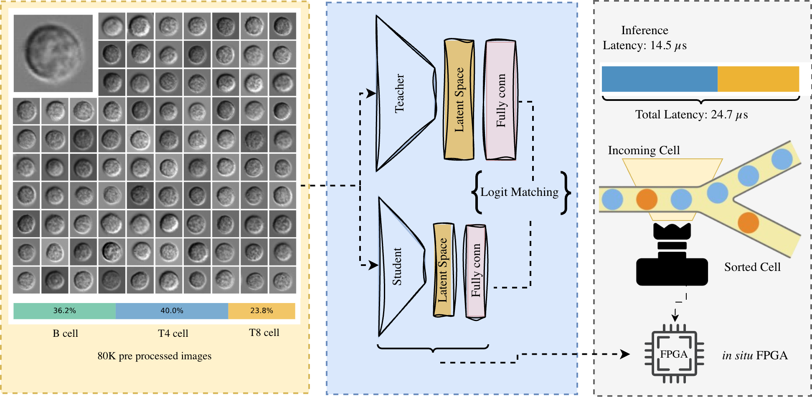

# LymphoML: Label-Free Lymphocyte Classification Framework

LymphoML is a state-of-the-art machine learning framework for label-free cell classification, specifically designed for real-time sorting applications using bright-field microscopy images. This framework leverages a teacher-student model architecture enhanced by knowledge distillation, achieving high efficiency and scalability across different cell types.

Demonstrated through a use case of classifying lymphocyte subsets, our framework accurately classifies T4, T8, and B cell types with a dataset of 80,000 preprocessed images. The teacher model attains 98% accuracy in differentiating T4 cells from B cells and 93% accuracy in zero-shot classification between T8 and B cells. Remarkably, our student model operates with only 0.02% of the teacher model's parameters, enabling field-programmable gate array (FPGA) deployment.

Our FPGA-accelerated student model achieves an ultra-low inference latency of just 14.5 μs and a complete cell detection-to-sorting trigger time of 24.7 μs, delivering 12x and 40x improvements over the previous state-of-the-art real-time cell analysis algorithm in inference and total latency, respectively, while preserving accuracy comparable to the teacher model.



## Key Features

- **Label-Free Classification**: Eliminates the need for costly and time-intensive molecular labeling
- **Teacher-Student Architecture**: Leverages knowledge distillation for efficient model deployment
- **Ultra-Low Latency**: FPGA implementation achieves 14.5 μs inference latency
- **High Accuracy**: 98% accuracy in T4 vs B cell classification
- **Transfer Learning**: Demonstrated capability for zero-shot classification of new cell types
- **Open-Source Dataset**: 80,000 preprocessed lymphocyte images

## File Structure

```txt
LymphoML/
├── main.py                  # Main entry point for training models
├── trainer.py               # Training routines and configurations
├── utils.py                 # Utility functions for data manipulation and visualization
├── config.py                # Configuration management
├── logger.py                # Logging utilities
├── models/
│   ├── __init__.py
│   ├── teacher.py           # Teacher model architecture (ResNet50)
│   ├── Student1.py          # Student model 1 architecture (ResNet18)
│   ├── Student2.py          # Student model 2 architecture (Lightweight CNN)
│   ├── distiller.py         # Knowledge distillation implementation
│   └── utils.py             # Model utility functions
├── data/
│   ├── __init__.py
│   ├── dataset.py           # Dataset loading and preprocessing
│   └── transformation/
│       ├── __init__.py
│       └── transforms.py    # Data augmentation routines
├── configs/
│   ├── teacher_config.json  # Configuration for teacher model
│   ├── Student1_config.json # Configuration for Student1 model
│   └── Student2_config.json # Configuration for Student2 model
├── callbacks/
│   ├── __init__.py
│   └── CometCallback.py     # Callbacks for comet_ml integration
├── checkpoint/              # Directory for saved model checkpoints
├── dataset/                 # Directory for dataset storage
├── images/                  # Directory for images and visualizations
├── .gitignore
├── requirements.txt
└── README.md
```

## Getting Started with LymphoML

Follow these steps to set up the LymphoML framework and start classifying lymphocyte cells.

### Prerequisites

- Python 3.7+
- CUDA-compatible GPU (recommended for training)

### Installation

```bash
# Clone the repository
git clone https://github.com/yourusername/LymphoML.git
cd LymphoML

# Install dependencies
pip install -r requirements.txt
```

### Training the Models

```bash
# Train the teacher model
python main.py --config configs/teacher_config.json

# Train Student1 model with knowledge distillation
python main.py --config configs/Student1_config.json

# Train Student2 model with knowledge distillation
python main.py --config configs/Student2_config.json
```

### FPGA Deployment

For FPGA deployment of the Student2 model, refer to the documentation in the `fpga_deployment` directory.

## Built With

This project is built with the following frameworks and libraries:

* [![PyTorch][PyTorch-shield]][PyTorch-url]
* [![NumPy][numpy-shield]][numpy-url]
* [![Torchvision][Torchvision-shield]][Torchvision-url]
* [![Comet ML][CometML-shield]][CometML-url]
* [![Matplotlib][matplotlib-shield]][matplotlib-url]
* [![hls4ml][hls4ml-shield]][hls4ml-url]
* [![Pandas][pandas-shield]][pandas-url]

## License

Distributed under the Apache License. See `LICENSE` for more information.

[](./LICENSE)

## Contact

Khayrul Islam - [@LinkedIN](https://linkedin.com/in/khayrulbuet13) - khayrulbuet13@alum.lehigh.edu

Project Link: [https://github.com/Khayrulbuet13/MIML](https://github.com/Khayrulbuet13/MIML)


## Acknowledgments

This project is funded by:


<p align="right">(<a href="#readme-top">back to top</a>)</p>

<!-- MARKDOWN LINKS & IMAGES -->
[PyTorch-shield]:https://img.shields.io/static/v1?style=for-the-badge&message=PyTorch&color=EE4C2C&logo=PyTorch&logoColor=FFFFFF&label=
[PyTorch-url]:https://pytorch.org

[NumPy-shield]: https://img.shields.io/static/v1?style=for-the-badge&message=NumPy&color=013243&logo=NumPy&logoColor=FFFFFF&label=
[NumPy-url]: https://numpy.org

[Matplotlib-shield]: https://img.shields.io/badge/Matplotlib-%23ffffff.svg?style=for-the-badge&logo=Matplotlib&logoColor=black
[Matplotlib-url]: https://matplotlib.org

[Torchvision-shield]: https://img.shields.io/badge/Torchvision-06bcee?style=for-the-badge&logo=PyTorch&logoColor=white
[Torchvision-url]: https://pytorch.org/vision/stable/index.html

[CometML-shield]: https://img.shields.io/badge/CometML-9cf?style=for-the-badge&logo=CometML&logoColor=white
[CometML-url]: https://www.comet.ml

[hls4ml-shield]: https://img.shields.io/badge/hls4ml-4caf50?style=for-the-badge&logo=hls4ml&logoColor=white
[hls4ml-url]: https://github.com/fastmachinelearning/hls4ml

[Pandas-shield]: https://img.shields.io/badge/Pandas-150458?style=for-the-badge&logo=pandas&logoColor=white
[Pandas-url]: https://pandas.pydata.org
